

# Harmony Home Automation Platform

Intelligent, modular Smart Home platform unifying IoT devices, rule automations and a conversational AI layer.

A modular smart‑home web platform (Angular + .NET) integrating multiple ecosystems (Fibaro, Home Assistant, IP cameras) with a rule automation engine and conversational AI.

---

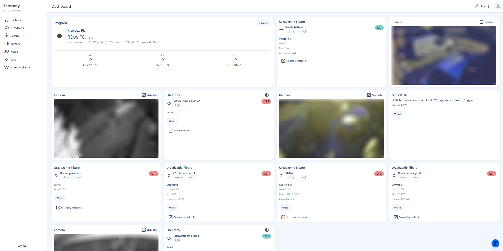

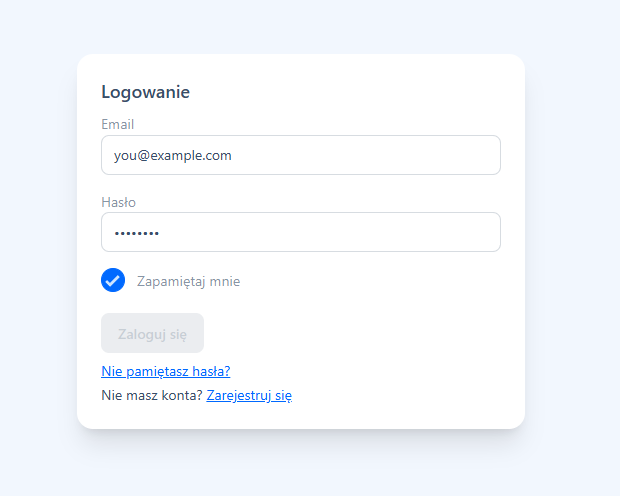
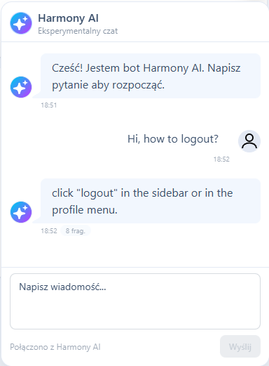
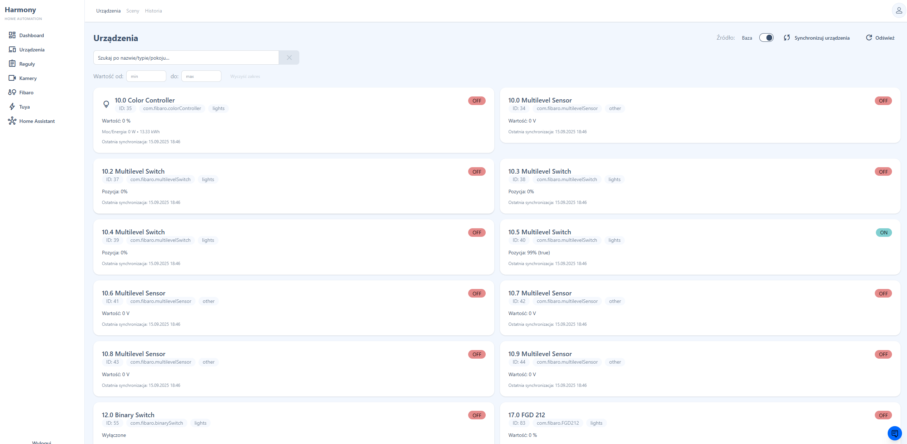
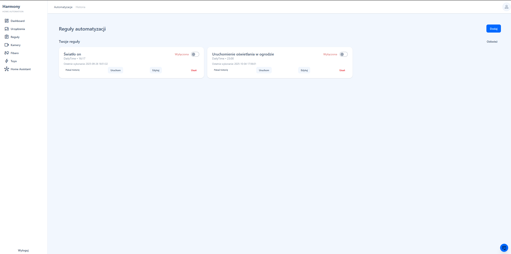
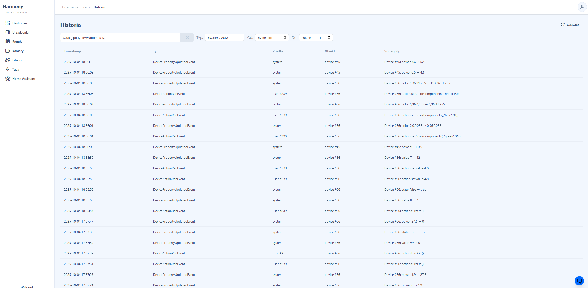

---

&nbsp;&nbsp;&nbsp;&nbsp;&nbsp;

&nbsp;&nbsp;-green?style=flat)&nbsp;

Showcase repository (documentation + screenshots). Core source code is private; this material curates key architectural and product highlights for portfolio purposes.

---

## 0. Executive TL;DR
Unified Smart Home platform consolidating fragmented IoT ecosystems into one secure, transparent control surface: devices + predictable automation + conversational AI + low‑latency camera streaming, all under a deny‑by‑default authorization model.

## 1. Problem → Solution → Outcome
**Problem (Fragmentation):** Users juggle multiple vendor apps (Fibaro, Home Assistant, raw camera URLs) with duplicated device concepts and opaque automation failures.
**Problem (Lack of Transparency):** Traditional rule engines give little insight into why a rule did or did not fire; debugging becomes guesswork.
**Problem (Cognitive Overhead):** Turning intent ("Dim the hallway lights at sunset unless motion") into precise multi‑system actions requires expert knowledge.

**Solution:** A unified orchestration and automation platform:
- Single device & scene abstraction (Adapter + Orchestrator) spanning providers.
- Minute‑aligned automation loop with pluggable triggers & actions.
- Conversational AI layer translating natural language into structured, auditable intents.
- Managed FFmpeg pipeline producing short‑segment HLS for near real‑time camera viewing.
- Deny‑by‑default Resource/Action authorization to prevent accidental exposure.
- Rich observability: execution history + system timeline + provenance for AI answers.

**Outcome:** Faster rule iteration, reduced cognitive load, explainable automations, consistent UX, improved security posture, and a foundation for AI‑assisted expansion (suggested rules, anomaly insights).

## 2. Core Pillars
| Pillar | User / Business Value | Key Mechanism |
|--------|-----------------------|---------------|
| Devices Unification | One mental model across vendors | Adapter + Orchestrator abstraction |
| Automation Engine | Consistent & explainable outcomes | Minute‑aligned scheduler + trigger evaluators + action executors |
| AI Layer | Natural language → structured action | Embeddings + intent normalization + provenance surfacing |
| Security | Prevents accidental exposure | Deny‑by‑default Resource/Action authorization middleware |
| Streaming | Low friction situational awareness | Managed FFmpeg → short (2s) HLS segments + cleanup |
| Observability | Faster debugging & trust | Timeline + execution history + structured logs |
| Extensibility | Sustainable feature growth | Plug‑in triggers, actions, integrations (DI multi‑registration) |

## 3. Architecture Overview
**Frontend (Angular SSR + Tailwind):** Standalone feature domains (`devices`, `cameras`, `rules`, `integrations`, `ai`, `auth`). Reusable UI primitives keep styling consistent; interceptors centralize base URL, auth, XSRF.

**Backend (.NET 10):** Modular service composition; controllers thin → orchestrators / services; deterministic background worker (automation); AI chat & embedding layer; FFmpeg streaming manager.

**Security:** Explicit Resource/Action attributes enforced centrally; JWT + future MFA (TOTP implemented, WebAuthn planned). Rate limiting for AI endpoints.

**Observability:** Structured logs (Serilog), execution history & system timeline for correlation; provenance surfaced in AI responses.

**Performance Considerations:** Short HLS segments (2s) for latency; `-codec copy` to avoid unnecessary transcode; minute boundary alignment reduces scheduling drift.

**Extensibility:** New trigger/action/integration added via DI registration—no core refactor required.

Diagrams:
- Context: [`diagrams/context.md`](./diagrams/context.md)
- Containers: [`diagrams/containers.md`](./diagrams/containers.md)
- Backend Components: [`diagrams/components-backend.md`](./diagrams/components-backend.md)
- Frontend Components: [`diagrams/components-frontend.md`](./diagrams/components-frontend.md)

## 4. Deep Dives Index
- C4 Level 1 Context: [`diagrams/context.md`](./diagrams/context.md)
- C4 Level 2 Containers: [`diagrams/containers.md`](./diagrams/containers.md)
- Backend Components: [`diagrams/components-backend.md`](./diagrams/components-backend.md)
- Frontend Components: [`diagrams/components-frontend.md`](./diagrams/components-frontend.md)
- Sequence – Automation Execution: [`diagrams/sequence-automation.md`](./diagrams/sequence-automation.md)
- Sequence – AI Command Orchestration: [`diagrams/sequence-ai-command.md`](./diagrams/sequence-ai-command.md)
- Code Snippets (Security): [`code-snippets/security/`](./code-snippets/security/)
- Code Snippets (Automation): [`code-snippets/automation/`](./code-snippets/automation/)
- Code Snippets (AI): [`code-snippets/ai/`](./code-snippets/ai/)
- Code Snippets (Streaming): [`code-snippets/streaming/`](./code-snippets/streaming/)
- Code Snippets (Integrations): [`code-snippets/integrations/`](./code-snippets/integrations/)

## 5. Feature Matrix (Excerpt)
| Feature | Status | Notes |
|---------|--------|-------|
| Unified Device Catalog | ✅ | Fibaro + Home Assistant abstraction (Tuya ready) |
| Rule Automation Engine | ✅ | Deterministic minute cycle + debounce |
| Conversational AI | ✅ | Intent normalization + provenance chunks |
| Camera Streaming | ✅ | Managed FFmpeg → 2s HLS segments |
| Deny-by-Default AuthZ | ✅ | Missing metadata ⇒ 403 enforced centrally |
| TOTP MFA Foundation | ✅ | Encrypted secrets, lockout strategy |
| WebAuthn | 🔜 | Planned (frontend scaffolding) |
| AI Rule Suggestions | 🔜 | Planned (embedding + pattern mining) |
| Energy Analytics | 🔜 | Planned (time‑series & widgets) |

## 6. AI & Automation Flow
The AI layer turns conversational intent into orchestrated actions while preserving traceability:
1. Embed curated docs & capability descriptors (offline build step) → semantic index.
2. User prompt → semantic retrieval (top relevant chunks) → context assembly.
3. Intent normalization boundary converts free text into structured command (type + parameters + optional safety checks).
4. If actionable → orchestrator executes device/scene/rule test; else returns informational answer.
5. Provenance (used chunks + executed actions) returned to UI for trust & audit.

Sequence reference: [`diagrams/sequence-ai-command.md`](./diagrams/sequence-ai-command.md)

Automation engine complements AI by executing scheduled / event-driven rules:
- Minute‑aligned loop reduces temporal drift and simplifies reasoning.
- Trigger evaluators isolate rule activation logic (time windows / event checks / future device state observers).
- Action executors perform idempotent operations against unified device abstraction.
- Execution history persists outcome (timestamp, success/failure, metadata) for debugging and analytics.

Sequence reference: [`diagrams/sequence-automation.md`](./diagrams/sequence-automation.md)

Future focus: AI‑assisted rule template suggestions; counterfactual “why didn’t this run?” diagnostics.

## 7. Security & Privacy
Security is foundational—not retrofitted:
| Aspect | Approach | Value |
|--------|----------|-------|
| Authorization | Deny‑by‑default Resource/Action attributes + middleware | Eliminates accidental open endpoints |
| Authentication | JWT (short‑lived) + refresh + MFA readiness (TOTP encrypted) | Layered defense |
| MFA Secret Protection | AES‑GCM versioned envelope | Integrity + future rotation |
| Rate Limiting (AI) | Catch & signal with Retry‑After header | Predictable client backoff |
| Secret Handling | Env variables for model keys / integration credentials | Avoids repo leakage |
| Defense in Depth | Central logging of deny reasons | Faster audit & forensics |
| Least Privilege | Granular Resource/Action taxonomy | Minimal surface exposure |

Snippet (auth middleware) planned: [`code-snippets/security/`](./code-snippets/security/)

Future items:
- WebAuthn second factor.
- Endpoint-level anomaly detection (excessive failed rule modifications).
- Optional signed HLS playlist URLs.

## 8. Streaming Pipeline (Low-Latency HLS)
Goals: near real‑time camera visibility, stable resource usage, safe restarts.
- RTSP input → FFmpeg managed process → 2s HLS segments (ring buffer of ~10s window).
- Deletion flags (`delete_segments+append_list`) keep storage minimal.
- `-codec copy` avoids heavy CPU; audio stripped (`-an`) when not needed to reduce bandwidth.
- Wrapper waits for playlist readiness (ensures UI does not 404 initial load).
- Health: if no playlist update within threshold → restart routine (planned snippet).

Advantages:
- Lower latency vs traditional 6–8s segments.
- Stable memory/disk footprint via aggressive cleanup.
- Clear isolation: Streaming Service boundary keeps FFmpeg specifics from polluting higher layers.

Planned snippets: [`code-snippets/streaming/`](./code-snippets/streaming/)

Future focus: adaptive segment length, optional per‑camera key rotation, exploratory WebRTC path.

## 9. Observability & Explainability
| Dimension | Mechanism | Benefit |
|-----------|-----------|---------|
| Automation Transparency | Execution history (rule id, timestamp, action results) | Rapid root cause analysis |
| System Timeline | Unified event ledger (device state, rule fire, integration updates) | Correlated narrative of system behavior |
| AI Provenance | Returned chunk metadata + executed action list | Trust & audit of AI outputs |
| Structured Logging | Enriched context (ruleId, triggerType, duration) | Filterable diagnostics & metrics export |
| Authorization Denials | Reason codes (MissingMetadata / Denied) | Fast permission gap detection |
| Streaming Health | Playlist readiness & update timestamps | Early anomaly detection |

Future instrumentation:
- Latency histogram for rule evaluation vs execution.
- Per integration error budget (e.g., Fibaro API failure rate).
- OpenTelemetry traces (Controller → Orchestrator → Adapter).

## 10. Screens Gallery
Curated functional snapshots (all test / demo data). Each caption states purpose & value quickly.

### 10.1 Authentication & Account Flows
| Screen | Image | Caption |
|--------|-------|---------|
| Login |  | Entry point with validation; MFA‑ready layout. |
| Registration | 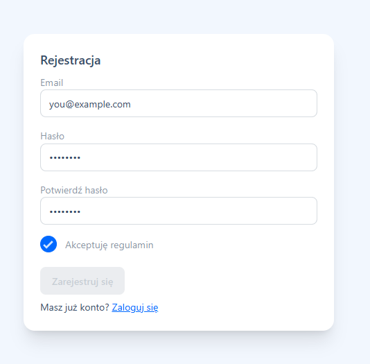 | Low friction onboarding; future email verify slot. |
| Reset Request | 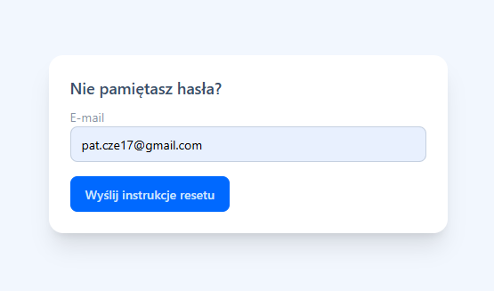 | Single‑field flow to reduce abandonment. |
| Reset Email | 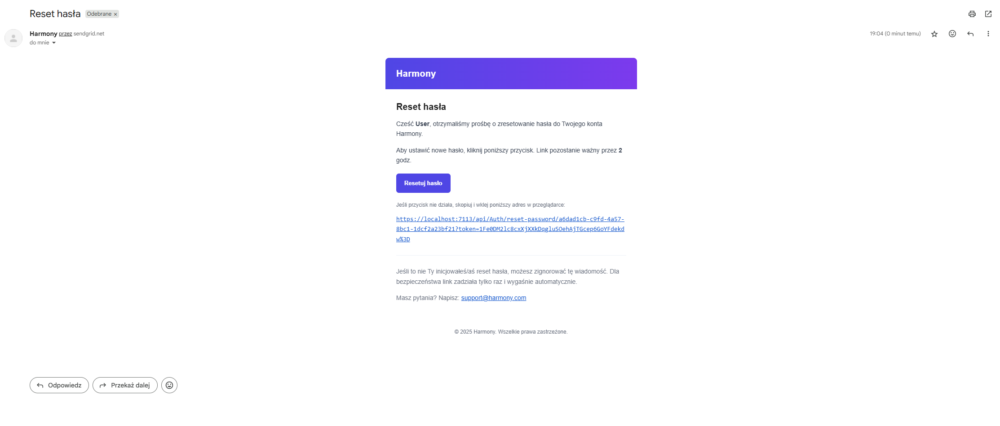 | Transactional template consistency. |
| Reset Continue | 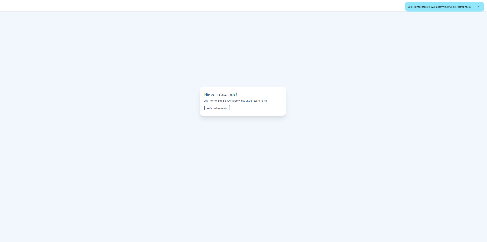 | Token validation & secure progression. |
| Set New Password | 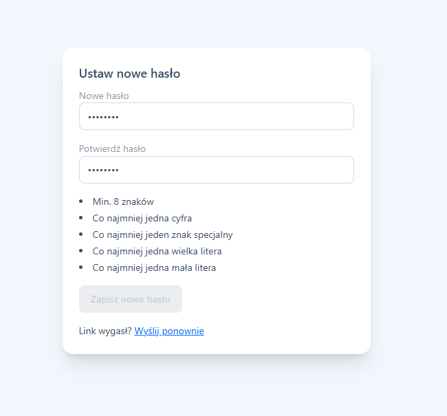 | Final step with strength checks (extensible). |

### 10.2 Dashboard & Overview
| Screen | Image | Caption |
|--------|-------|---------|
| Dashboard |  | Unified status & quick navigation hub. |

### 10.3 AI Layer
| Screen | Image | Caption |
|--------|-------|---------|
| Chat |  | Natural language orchestration & insight. |
| AI Settings | 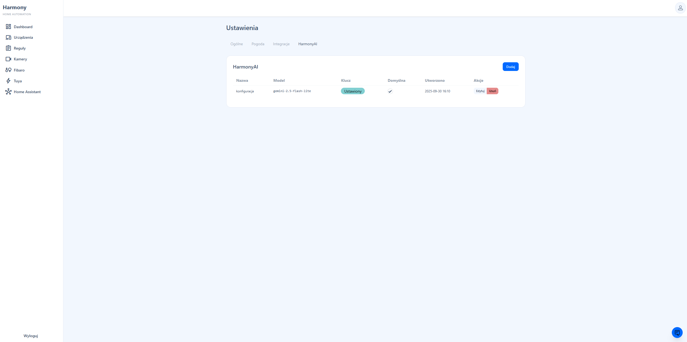 | Adjustable model parameters & grounding settings. |

### 10.4 Integrations & Devices
| Screen | Image | Caption |
|--------|-------|---------|
| Add Integration | 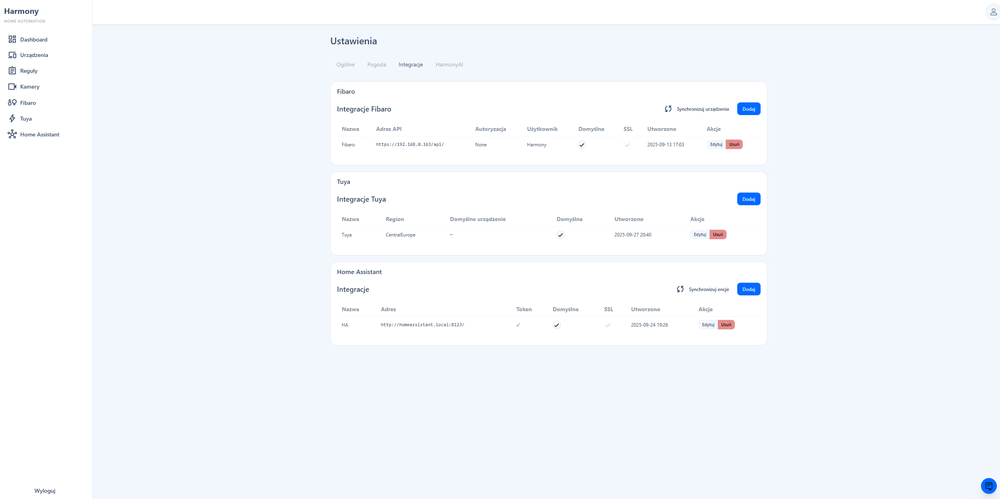 | Plugin‑style provider onboarding. |
| Fibaro Devices |  | Unified device catalog abstraction. |
| Fibaro Device Control |  | Dynamic UI based on device capabilities. |
| Fibaro Scenes | 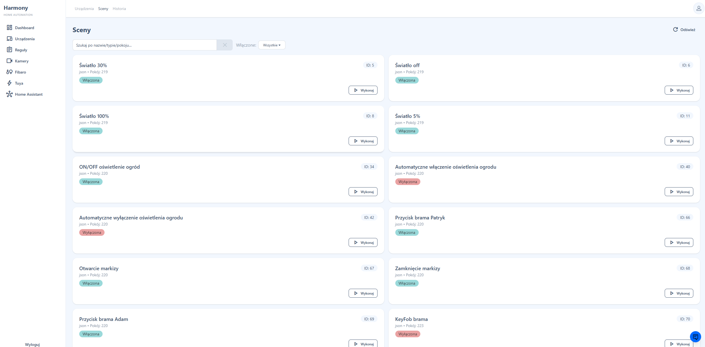 | Scene execution & automation targets. |

### 10.5 Cameras & Streaming
| Screen | Image | Caption |
|--------|-------|---------|
| Cameras Overview | 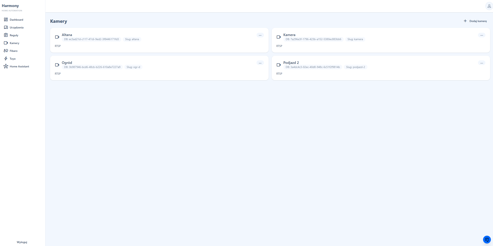 | Rapid situational awareness. |
| Live View | 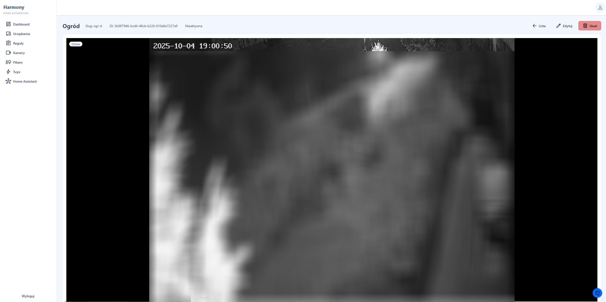 | Low‑latency HLS playback. |
| Add Camera | 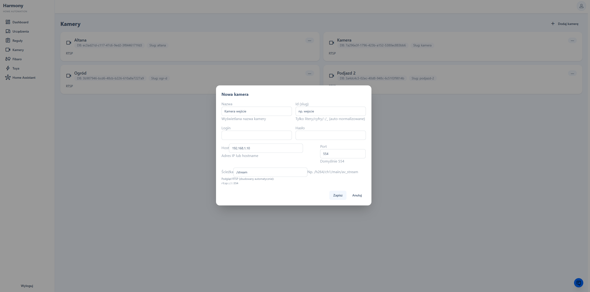 | Stream configuration & validation. |

### 10.6 Rules & Automation
| Screen | Image | Caption |
|--------|-------|---------|
| Rules List |  | Global overview & activation state. |
| Rule Create (Empty) | 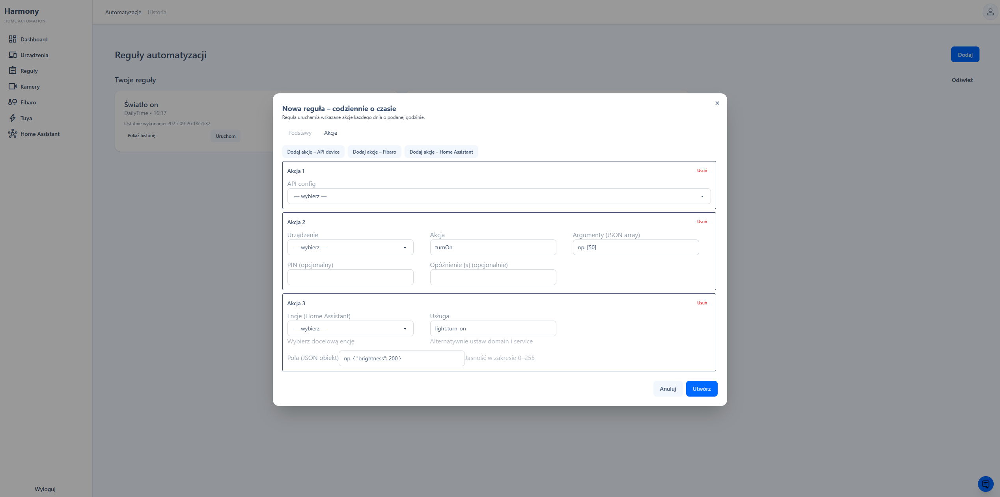 | Structured trigger/action composition. |
| Rule Create (Form) | 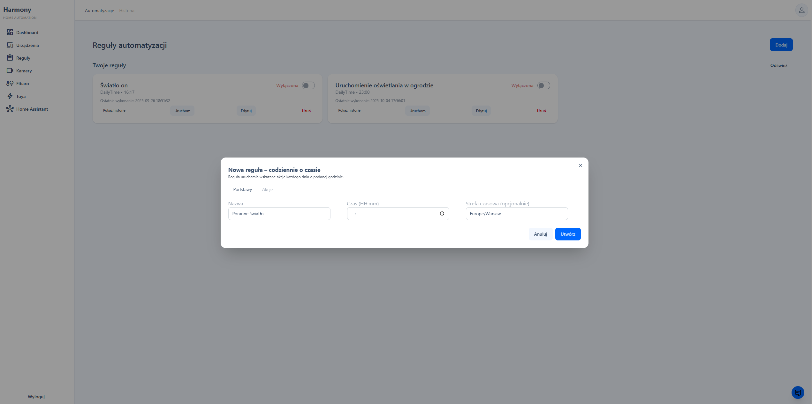 | Rule configuration interface layout. |
| Automation History | 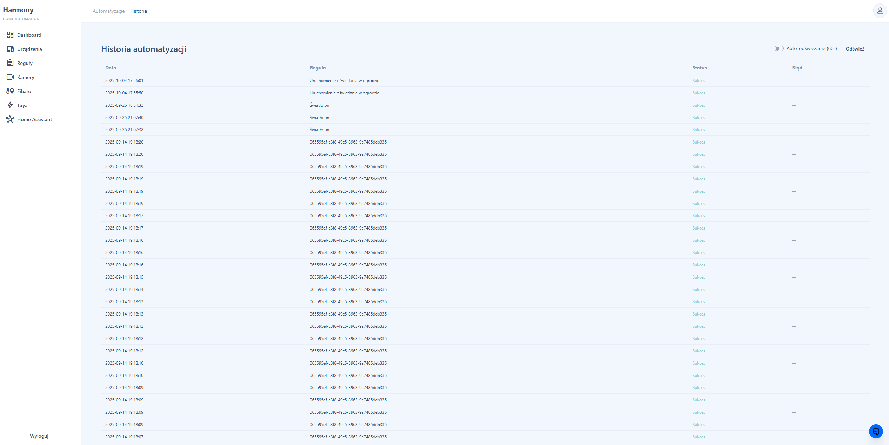 | Execution log for explainability. |

### 10.7 Timeline & Diagnostics
| Screen | Image | Caption |
|--------|-------|---------|
| System Timeline |  | Correlated events & audit trail. |
| Test Coverage | 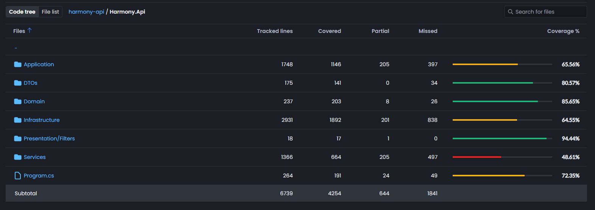 | Quality signal on critical paths. |

### 10.8 Interactive Demonstrations
Live functionality demonstrations showing key workflows:

| Feature | Animation | Description |
|---------|-----------|-------------|
| Fibaro Device Control | 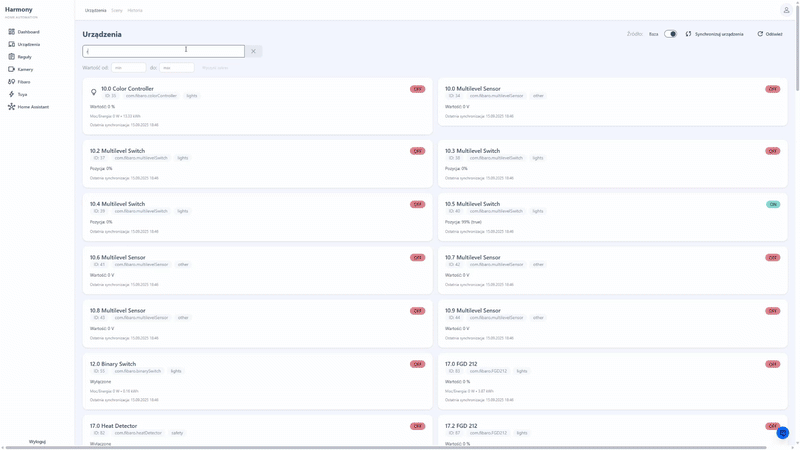 | Real-time color and brightness adjustment for Fibaro RGBW devices |
| Home Assistant Dashboard | 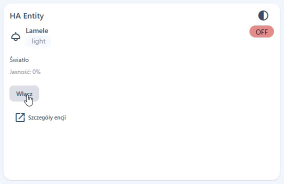 | Toggle entities and control devices through unified Home Assistant integration |
| AI Interaction | 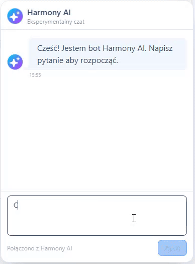 | Natural language queries and device control through conversational AI interface |
| Camera Live Stream | 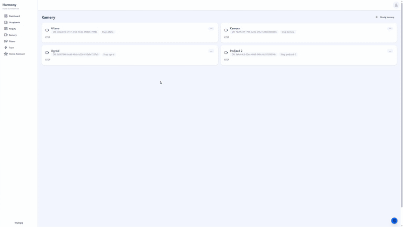 | Low-latency camera stream activation and real-time video feed |
| Automation Creation | 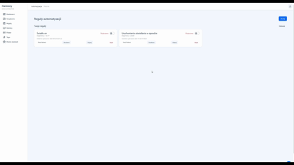 | Complete workflow for creating and configuring automation rules |

## 11. Code Highlights
Concise, value‑focused fragments (full context in respective snippet directories):

| Area | Problem | Solution (Snippet) | Engineering Value |
|------|---------|--------------------|-------------------|
| Authorization | Accidental open endpoints | Deny-by-default middleware → [`deny-by-default-authorization.cs`](./code-snippets/security/deny-by-default-authorization.cs) | Shrinks attack surface, explicit contract |
| Automation | Timing drift & duplicates | Minute boundary loop + debounce → [`scheduler-loop.cs`](./code-snippets/automation/scheduler-loop.cs) | Determinism & auditability |
| Streaming | Stale segments & race on initial load | Managed FFmpeg startup wrapper → [`ffmpeg-start-wrapper.cs`](./code-snippets/streaming/ffmpeg-start-wrapper.cs) | Reliability & low latency |
| AI Intent | Unstable model phrasing | Intent normalization boundary → [`intent-normalization.cs`](./code-snippets/ai/intent-normalization.cs) | Provider portability, explainability |
| MFA Security | Secret leakage risk | AES‑GCM encryption layer → [`totp-encryption-service.cs`](./code-snippets/security/totp-encryption-service.cs) | Confidentiality & rotation readiness |
| Rate Limiting | Unbounded AI/login attempts | Sliding window limiter → [`rate-limiter.cs`](./code-snippets/security/rate-limiter.cs) | Predictable consumption | 

Additional evidence snippets: TOTP encryption, rate limiter, intent normalization.

### 11.a Evidence & Artifacts Index
| Category | Location | Purpose |
|----------|----------|---------|
| Context Diagram | `diagrams/context.md` | External actors & high-level system boundary |
| Containers | `diagrams/containers.md` | Backend vs frontend deployment view |
| Backend Components | `diagrams/components-backend.md` | Service & module responsibilities |
| Frontend Components | `diagrams/components-frontend.md` | Feature domain boundaries |
| Automation Sequence | `diagrams/sequence-automation.md` | Rule evaluation & execution flow |
| AI Command Sequence | `diagrams/sequence-ai-command.md` | Intent normalization & orchestration path |
| AuthZ Middleware | `code-snippets/security/deny-by-default-authorization.cs` | Central enforcement contract |
| Automation Loop | `code-snippets/automation/scheduler-loop.cs` | Deterministic slot scheduler |
| Streaming Wrapper | `code-snippets/streaming/ffmpeg-start-wrapper.cs` | Reliable low-latency startup |
| Intent Normalizer | `code-snippets/ai/intent-normalization.cs` | Stable command structuring |
| MFA Secret Encryption | `code-snippets/security/totp-encryption-service.cs` | Protected TOTP seed storage |
| Rate Limiter | `code-snippets/security/rate-limiter.cs` | Controlled consumption & lockout |
| Fibaro Device Control Demo | `gifs/fibaro-device-control.gif` | Interactive RGBW device control demonstration |
| Home Assistant Integration Demo | `gifs/home-assistant-dashboard.gif` | Unified dashboard entity control workflow |
| AI Interaction Demo | `gifs/harmony-ai-interaction.gif` | Conversational AI device control showcase |
| Camera Streaming Demo | `gifs/camera-live-view.gif` | Low-latency live stream activation |
| Automation Creation Demo | `gifs/automation-rule-creation.gif` | Complete rule creation workflow |
| Contrast | `CONTRAST.md` | Key differentiators vs typical OSS |

## 12. My Role & Engineering Decisions
I designed and implemented the full stack: architecture, abstractions, security hardening, AI orchestration, automation engine, and streaming pipeline. Key decisions and rationale:

| Decision | Rationale | Impact |
|----------|-----------|--------|
| Resource/Action deny-by-default model | Prevent silent exposure; machine-derivable permission map | Higher baseline security |
| Minute-aligned automation loop | Fixed time slots simplify reasoning & logs correlation | Predictable execution |
| Pluggable trigger/action interfaces | Localize change & enable domain growth | Faster feature iteration |
| Intent normalization boundary (AI) | Decouple model variability from orchestration logic | Provider agility & explainability |
| Short HLS segments (2s) + cleanup flags | Balance latency vs resource usage | Smooth camera UX |
| Embedding provenance surfaced to UI | Build user trust & auditing capability | Explainable AI |
| AES-GCM versioned secret format | Forward-compat for rotation & integrity | Reduced migration risk |
| Structured logging strategy (contextual keys) | Queryable diagnostics & future observability pipeline | Faster MTTR |

Leadership / Ownership aspects:
- Unified product narrative (business value + engineering clarity).
- Early security baked into architecture (not bolted on).
- Focus on extension seams to avoid architectural dead ends.
- Documentation-first ethos (diagrams + curated snippets) to accelerate reviewer comprehension.

## 13. Roadmap (Focused)
| Theme | Item | Value |
|-------|------|-------|
| Security | WebAuthn 2FA | Stronger phishing resistance |
| AI Assist | Rule suggestion & refinement loop | Faster automation authoring |
| Analytics | Energy usage time-series & widgets | Insight → optimization |
| Notifications | Push (PWA) critical event alerts | Real-time awareness |
| Observability | OpenTelemetry tracing | Deep performance & dependency insight |
| Streaming | Adaptive segment length | Resilience on constrained networks |
| Extensibility | Integration marketplace scaffold | Community-driven growth |

## 14. Portfolio Fit / Why It Matters
| Reviewer Lens | What This Demonstrates |
|---------------|------------------------|
| Architect | Clear seams (triggers, actions, adapters) & security-first model |
| Backend Engineer | Predictable scheduling, structured logging, extensible authorization |
| Frontend Engineer | Feature isolation, SSR strategy, consistent UI primitives |
| AI Engineer | Intent normalization, provenance & retrieval pattern |
| DevOps / Reliability | Process supervision (FFmpeg), minimal drift automation design |
| Product / Stakeholder | Cohesive narrative: solves fragmentation with explainable intelligence |

### 14.a Recruiter 30s Pitch
- Scope: Full-stack architecture + security + AI orchestration + automation engine + streaming.
- Differentiators: Deny-by-default authZ, predictable automation loop, provenance-backed AI, managed FFmpeg latency control.
- Evidence: Curated code snippets, C4 diagrams, execution history & timeline UX.
- Outcome: Lower operational guesswork, safer extension surface, faster iteration, audit-friendly automations.

## 15. Contrast & Differentiators
For a structured comparison vs typical open‑source smart‑home stacks (authorization, automation determinism, AI boundary, streaming control, observability) see: [CONTRAST.md](./CONTRAST.md).

Essence of the delta:
- Security: Explicit Resource/Action deny‑by‑default (no silent exposure) vs permissive role checks.
- Automation: Minute-aligned loop (auditable) vs mixed cron/timer drift.
- AI: Intent normalization boundary + provenance vs opaque direct model calls.
- Streaming: Managed FFmpeg lifecycle (latency + resource hygiene) vs ad-hoc scripts.
- Observability: User-facing execution timeline vs log-only backend diagnostics.

Outcome: Lower cognitive load for reviewers, safer extension surface, easier root cause analysis, and explainable AI interactions by design.

## 16. Request a Private Demo (CTA)
Want a deeper walkthrough (architecture Q&A, security rationale, AI + automation live flow)? Reach out:

- LinkedIn: https://www.linkedin.com/in/ (placeholder – shared on request)
- Email: demo.request (at) example.com (replace (at) with @)
- Optional: Add brief context (team size, interest focus: AI / Automation / Security / Streaming) so I can tailor the session.

Format & SLA:
- 30–40 min technical session (screenshare) + follow-up summary notes.
- Response SLA: < 24h CET (business days).

Privacy: Demo uses scrubbed sample data. No proprietary information from your side retained post-session.

### Security Checklist (Showcase Publication)
- [x] No private IPs (grep `192.168.`) present.
- [x] No raw secrets / API tokens committed.
- [x] Environment variable names only (e.g. `GEMINI_API_KEY`) – no values.
- [x] TOTP secret handling described, not exposed.
- [x] No internal hostnames / credentials.
- [x] Code snippets trimmed & sanitized.

### Final TL;DR (EN)
Unified Smart Home platform delivering explainable automation, conversational AI control, secure deny‑by‑default APIs and low‑latency camera streaming—engineered for determinism, extensibility and observability.

---

## Table of Contents
1. ✨ Overview & Problem Statement
2. 🚀 Key Capabilities
3. � Architecture Summary
4. 🤖 AI & Automation Engine
5. 🔐 Security & Observability
6. 🖼 Screenshots & Interactive Demos
7. 🧪 Technical Highlights (Backend & Frontend)
8. 🧭 Typical User Journeys
9. 🛠 Technology Stack
10. 🧑‍💻 My Role & Contributions
11. 📂 Repository Content
12. 🗺 Selected Roadmap
13. 🎯 Portfolio Value (Why It Matters)
14. 📜 License & Notes
15. 🔄 TL;DR

---

### Condensed Sections 1–6
Replaced by canonical structured equivalents:
- Overview → see TL;DR & Problem/Solution (sections 0 & 1)
- Key Capabilities → Feature Matrix & Pillars (sections 2 & 5)
- Architecture → Architecture Overview & Deep Dives Index (sections 3 & 4)
- AI & Automation → AI & Automation Flow (section 6)
- Security & Observability → sections 7 & 9 plus Security Checklist
- Screens Gallery → section 10

Legacy detailed prose intentionally removed to reduce redundancy and cognitive load.

---

## 7. 🧪 Technical Highlights
Backend:
- Modular DI composition; multi-registration for extensibility.
- Deterministic scheduled automation loop (minute alignment + debounce) for predictable rule execution.
- Secure resource/action authorization layer (explicit metadata or rejection).
- Low-latency HLS generation via managed FFmpeg processes.

Frontend:
- Feature-isolated domains with clear models/services/UI layering.
- Adapter-driven integration panels (heterogeneous device types unified in UI).
- Reusable primitives (cards, dialogs, dynamic control panels) for consistent UX.
- AI chat with contextual suggestions & provenance (used chunks).

### Test Coverage Snapshot
Illustrative coverage report excerpt (private source repository). Demonstrates commitment to targeted test depth around critical orchestration and security components.

---

## 8. 🧭 Typical User Journeys
1. New user: Register → configure integrations → add camera → create first rule → observe execution.
2. Power user: Drafts a rule in AI chat → system proposes structured template → refine & save.
3. Admin: Adds new Fibaro devices → controls scenes → integrates into automation.
4. Debug: Investigate failed rule → inspect automation history + system timeline → adjust parameters.

---

## 9. 🛠 Technology Stack
| Layer | Technologies |
|-------|-------------|
| Frontend | Angular (SSR), TypeScript, Tailwind, RxJS |
| Backend | .NET 10, ASP.NET Core, Serilog |
| AI | HarmonyAI.SDK (embeddings + chat orchestration) |
| Streaming | FFmpeg (RTSP → HLS short segments) |
| Security | JWT, deny‑by‑default authorization middleware, MFA-ready concepts |

---

## 10. 🧑‍💻 My Role & Contributions
I architected and implemented the full stack: design of modular device abstraction, automation engine loop, AI intent resolution path, security hardening (deny‑by‑default), and low-latency streaming wrapper. Additionally: crafted diagnostic UX (timeline + execution history) and extensibility patterns (trigger evaluators, action executors, integration adapters).

Key decisions:
- Using resource/action metadata instead of ad-hoc policy strings → lower cognitive overhead.
- Minute-slot deterministic scheduling → reproducible automation behaviour.
- Short HLS segments with aggressive cleanup → latency vs resource balance.
- Embedding-driven AI context to ground device control suggestions.

---

## 11. 📂 Repository Content
| Path | Description |
|------|-------------|
| `README.md` | This bilingual showcase overview |
| `images/` | UI screenshots |

---

## 12. 🗺 Selected Roadmap
- MFA hardening (WebAuthn UI, TOTP flows).
- AI-driven rule suggestions & refinement loops.
- Energy analytics (time-series & widgets).
- Push notifications (PWA) for critical events.
- E2E test harness (Playwright + synthetic mocks).
- Community integration marketplace.

---

## 13. 🎯 Portfolio Value (Why It Matters)
- Demonstrates end-to-end product thinking (UX + architecture + operations).
- Shows security-first mindset (explicit permission contracts).
- Highlights AI as an enabling layer, not a bolt-on feature.
- Provides observability patterns (timeline, structured execution logging).
- Scales via clear extension seams (triggers, executors, adapters).

---

## 15. 📜 License & Notes
Showcase only. Code snippets are illustrative; underlying private repository not included. Screens may display test data. Do not expose real credentials.

---

## 16. 🔄 TL;DR
Modular Smart Home platform: integrations + rules + AI + low-latency streaming; designed for clarity, security, extensibility & diagnostic transparency.

