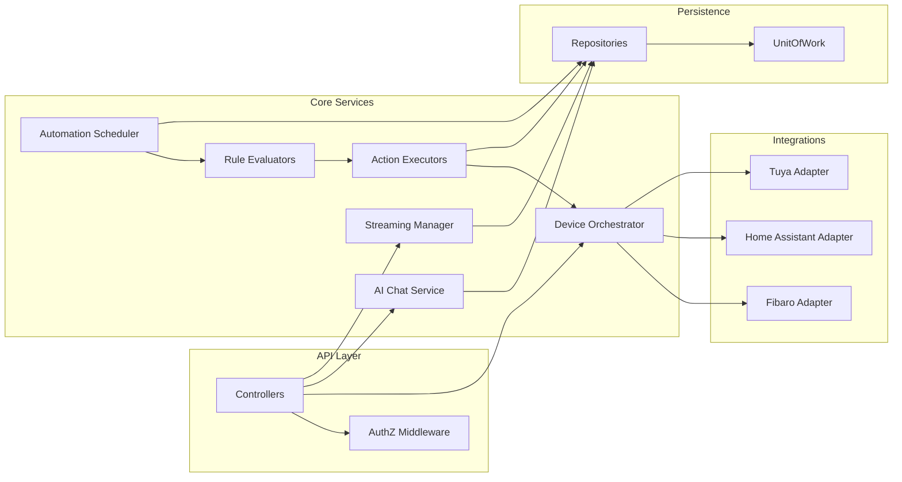

# Backend Components (Selected)

## Descriptions
- Device Orchestrator: Unifies heterogeneous device/scene commands.
- Automation Scheduler: Deterministic loop aligning to minute boundaries.
- Rule Evaluators: Pluggable trigger evaluation (time, device, future event types).
- Action Executors: Strategy objects executing domain actions (scene trigger, device command).
- Streaming Manager: Supervises FFmpeg processes and HLS artifact lifecycle.
- AI Chat Service: Embedding retrieval + intent normalization + orchestration.

## Extensibility Points
- Add a new trigger → implement evaluator and register DI.
- Add a new action → implement executor; no core changes.
- Add a new integration → adapter + registration + mapping layer.

See `components-frontend.md` for the frontend composition.
