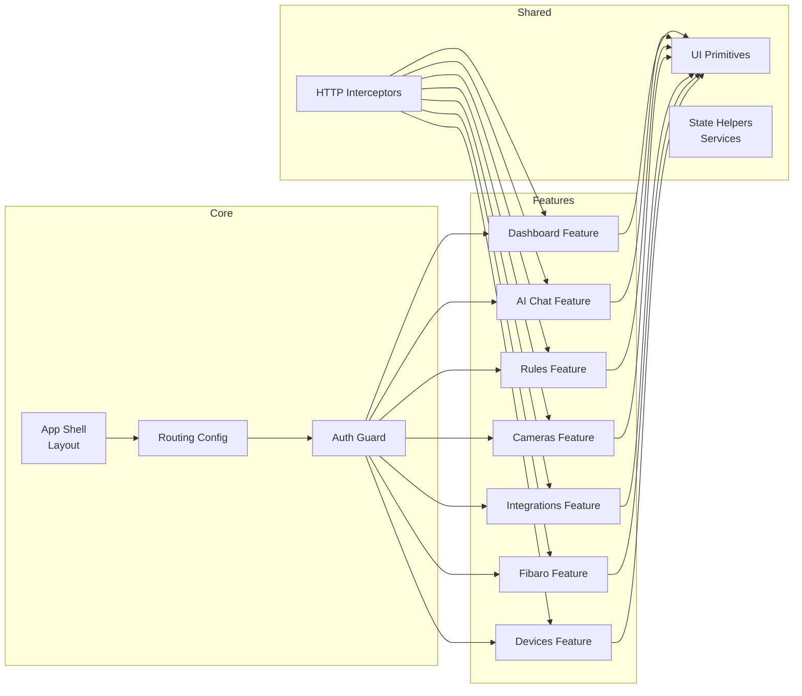

# Frontend Components (Selected)

## Notes
- Standalone Angular components reduce module overhead.
- UI Primitives ensure consistent styling (cards, dialogs, form controls).
- Interceptors centralize base URL, auth token, and XSRF handling.
- Features lazy-loaded where appropriate for performance.

Next: see `sequence-automation.md` and `sequence-ai-command.md` for dynamic flows.
