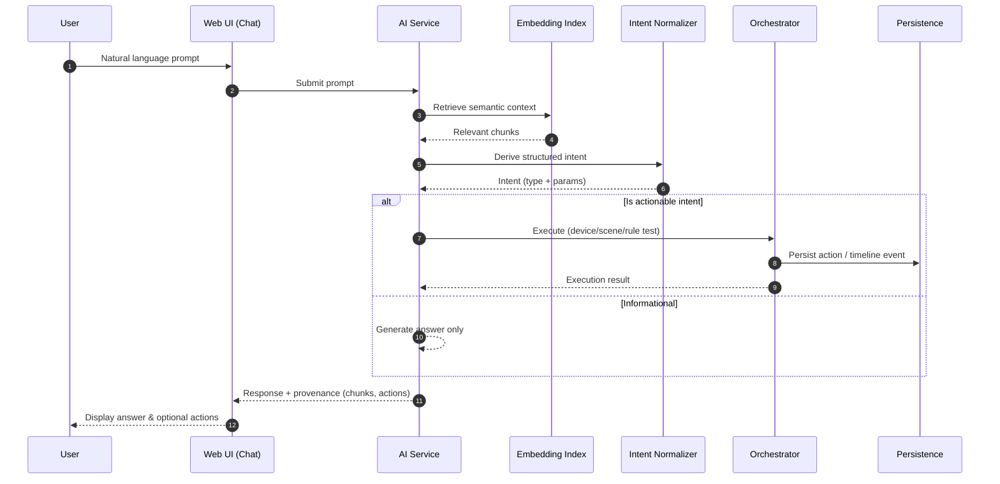

# Sequence – AI Command Orchestration

Highlights:
- Provenance (used chunks) surfaced to user for transparency.
- Intent layer isolates model phrasing changes from orchestration logic.
- Easy provider swap (model) since normalization boundary is stable.
