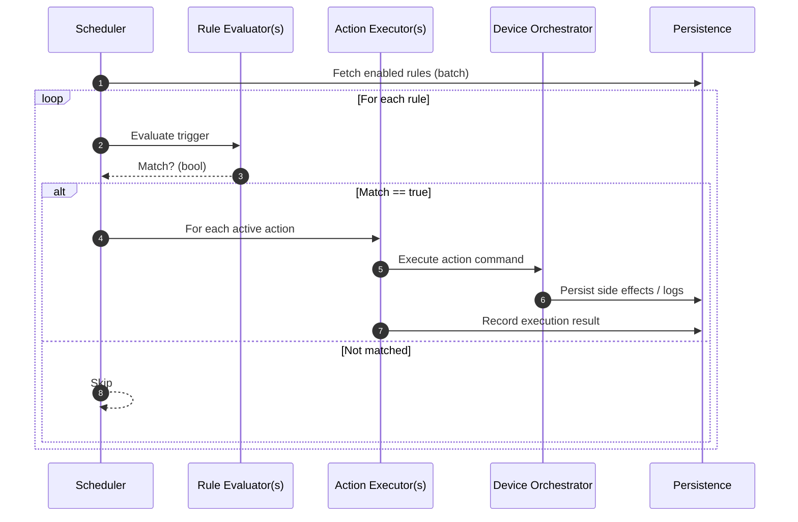

# Sequence – Rule Automation Execution

Notes:
- Deterministic: loop aligns with minute boundary (reduces drift).
- Debounce: prevents duplicate execution within same minute slot.
- Extensibility: new trigger/action requires only new evaluator/executor registered in DI.
